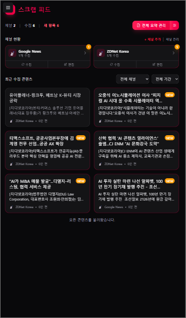

# 🌌 AI News Hub (Scrap Feed)

> **"Discover the Future of AI, Tailored Just for You."**

AI News Hub is a premium, Gemini-inspired news curation engine designed to keep you updated with the latest advancements in Artificial Intelligence.



## ✨ Key Features

-   **💎 Gemini Aesthetic**: A stunning UI/UX featuring blue-purple-pink gradients and refined glassmorphism.
-   **🎯 Precise Keyword Filtering**: Define focus keywords to filter and analyze news using Gemini AI.
-   **🔐 Custom Auth**: Secure JWT-based authentication with MySQL storage.
-   **🔔 Smart Notifications**: Hourly scheduler that sends personalized AI news digests via Web Push.
-   **🌍 Multi-language Support**: Seamless toggle between Korean and English.

## 🚀 Tech Stack

-   **Frontend**: Next.js 15, Tailwind CSS 4.0, Lucide React
-   **Backend**: Node.js, Express, Prisma ORM, MySQL
-   **AI**: Google Gemini AI (Generative AI SDK)
-   **Notifications**: Web-Push, Node-Cron

## 🚀 Getting Started

### 1. Database Setup
1. MySQL 데이터베이스를 준비합니다.
2. `backend/.env` 파일에 `DATABASE_URL`을 설정합니다.
3. `cd backend && npx prisma db push`를 실행하여 스키마를 동기화합니다.

### 2. Backend Setup
```bash
cd backend
npm install
npm run dev   # http://localhost:5000
```

### 3. Frontend Setup
```bash
cd frontend
npm install
npm run dev   # http://localhost:3000
```

### 4. Deployment
Docker configuration files are located in the `deploy/` directory.
```bash
cd deploy
docker-compose up -d
```

### 4. Deployment
Docker configuration files are located in the `deploy/` directory.
```bash
cd deploy
docker-compose up -d
```

## 📂 Environment Variables

### Backend (.env)
- `DATABASE_URL`: MySQL connection string.
- `JWT_SECRET`: Secret key for JWT signing.
- `GEMINI_API_KEY`: Google AI SDK key.
- `VAPID_PUBLIC_KEY` / `VAPID_PRIVATE_KEY`: Keys for browser push notifications.

### Frontend (.env.local)
- `NEXT_PUBLIC_API_URL`: URL of the backend service.
- `NEXT_PUBLIC_VAPID_PUBLIC_KEY`: Public key for web push enrollment.

---

Built with ❤️ by AI Enthusiasts.
